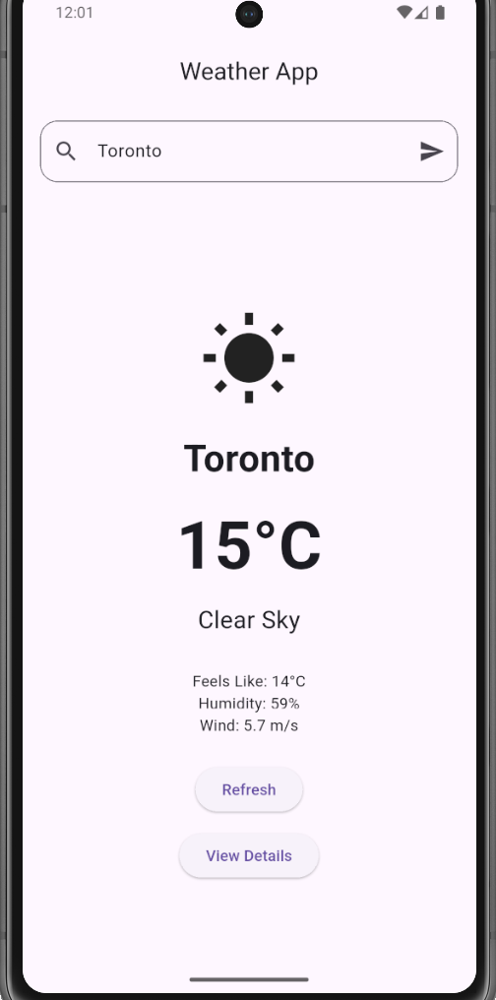
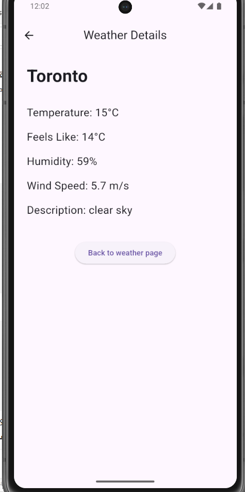

# 🌤️ Flutter Weather App

A Flutter weather application that fetches real-time weather data using the OpenWeather API.

The project uses the **BLoC (Business Logic Component) pattern** for state management and separates the UI, business logic, data model, and API service responsibilities.

The application has been tested on an **Android 15 emulator (API 35)**.

---

## 📱 Features

- Search weather by city
- Display current temperature
- Display feels-like temperature
- Display humidity
- Display wind speed
- Display weather condition and icon
- Refresh weather data
- Loading and error states
- Navigation using GoRouter
- Weather details screen
- Passing weather data between screens
- Custom back navigation

---

## 🛠️ Built With

- Flutter
- Dart
- flutter_bloc
- go_router
- REST API
- HTTP package
- OpenWeather API
- JSON parsing
- async/await

---

## 🧠 State Management

The application uses the **BLoC (Business Logic Component) pattern** to separate the UI from application logic.

The main data flow is:

```text
User Action
    ↓
Event
    ↓
WeatherBloc
    ↓
WeatherService
    ↓
OpenWeather API
    ↓
Weather Model
    ↓
State
    ↓
BlocBuilder
    ↓
UI
```

### Events

- `SearchWeather`

### States

- `WeatherInitial`
- `WeatherLoading`
- `WeatherLoaded`
- `WeatherError`

---

## 🧭 Navigation

The application uses **GoRouter** for navigation between screens.

The app currently contains two main screens:

- `WeatherPage` — displays the current weather information
- `DetailPage` — displays additional weather details

Navigation to the details screen is handled using:

```dart
context.push(
  '/details',
  extra: weather,
);
```

The existing `Weather` object is passed to the details screen using `extra`, avoiding an unnecessary second API request.

The data is received from `state.extra` and passed to `DetailPage`.

Custom back navigation is implemented using:

```dart
context.pop();
```

---

## 📂 Project Structure

```text
weather_app/
│
├── lib/
│   │
│   ├── bloc/
│   │   ├── weather_bloc.dart
│   │   ├── weather_event.dart
│   │   └── weather_state.dart
│   │
│   ├── models/
│   │   └── weather.dart
│   │
│   ├── screens/
│   │   ├── weather_page.dart
│   │   └── detail_page.dart
│   │
│   ├── services/
│   │   └── weather_service.dart
│   │
│   ├── utils/
│   │
│   ├── widgets/
│   │
│   ├── main.dart
│   └── router.dart
│
├── screenshots/
│   ├── weather_screen.png
│   └── detail_screen.png
│
├── test/
├── pubspec.yaml
└── README.md
```

---

## 🚀 Getting Started

### 1. Clone the repository

```bash
git clone https://github.com/AkramiSafoora/weather-app-flutter.git
```

### 2. Navigate to the project

```bash
cd weather-app-flutter
```

### 3. Install dependencies

```bash
flutter pub get
```

### 4. Start an Android emulator

Make sure an Android emulator is running.

You can check available devices using:

```bash
flutter devices
```

### 5. Run the application

Run the application using your own OpenWeather API key:

```bash
flutter run --dart-define=OPENWEATHER_API_KEY=YOUR_API_KEY
```

---

## 🔑 API Key

The OpenWeather API key is **not stored in the source code or repository**.

Create your own OpenWeather API key and provide it at runtime using:

```bash
flutter run --dart-define=OPENWEATHER_API_KEY=YOUR_API_KEY
```

The application reads the key using:

```dart
String.fromEnvironment('OPENWEATHER_API_KEY')
```

This keeps the API key out of the source code and GitHub repository.

---

## 📸 Screenshots

### Weather Screen



### Weather Details



---

## 👩‍💻 Author

**Safoora Akrami**

GitHub: AkramiSafoora